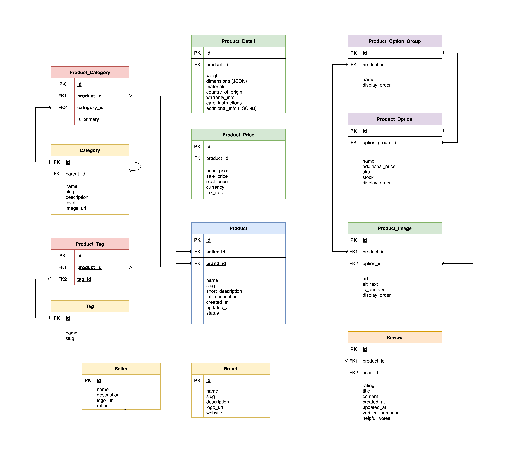

# 원티드 프리온보딩 챌린지 백엔드 31차 사전 과제

---

# CQRS 시스템 설계/구축 챌린지: 사전 과제 안내

안녕하세요, CQRS 시스템 설계/구축 챌린지 참가자 여러분!

본격적인 강의에 앞서 1회차 코드 실습의 준비 작업으로 사전 과제를 안내드립니다. 복잡한 연관 관계를 가진 모놀리식 구조의 이커머스 시스템을 구현하게 됩니다. 이는 추후 CQRS 패턴을 적용하여 다양한 데이터 저장소(MongoDB, Elasticsearch, Valkey)로 분리하는 과정의 기반이 될 것입니다.

> 📢 **안내사항**
> 
> 본 사전 과제는 전체를 완벽히 구현하실 필요는 없습니다. 챌린지 진행에는 지장이 없습니다.
>
> 다만, 다음과 같은 이유로 과제 내용을 검토해보시길 권장드립니다:
> - 챌린지에서 다룰 문제 상황을 빠르게 이해하는 데 도움이 됩니다
> - CQRS 시스템 패턴 도입의 필요성을 체감하실 수 있습니다
>
> 가장 이상적인 접근 방법은:
> 1. 사전 과제를 가능한 범위 내에서 구현해보고
> 2. 회차별 실습 내용을 직접 적용하면서 진행한 후
> 3. PR을 제출하여 강사와 커뮤니케이션하는 것입니다
>
> 물론, 여러분의 상황과 시간에 맞게 유연하게 참여하셔도 좋습니다!

## 과제 개요
**주제**: 복잡한 데이터 관계를 가진 모놀리식 아키텍처 기반의 이커머스 플랫폼 구현

### 기술 스택

- **데이터베이스**: PostgreSQL 15 이상
- **언어 및 프레임워크**: 아래 중 택 1
    - Java (Spring Boot)
    - Python (Django 또는 FastAPI)
    - Node.js (Express.js 또는 NestJS)

> 📢 **안내사항**
>
> 챌린지 내 실습은 **Java(Spring Boot)** 기반으로 진행됩니다.
>
> 하지만 다른 언어/프레임워크를 사용하시는 분들을 위해:
> - 구현 코드는 간결하게 작성할 예정입니다. (복잡한 코드 아키텍처 적용 X)
> - 핵심 개념과 로직에 대한 코드에는 상세 설명을 함께 제공할 것입니다.
> - 언어에 종속되지 않는 디자인 패턴과 아키텍처에 초점을 맞출 것입니다.
>
> 따라서 Python, Node.js 등 다른 기술 스택을 사용하시는 분들도 개념을 이해하고 적용하는 데 어려움이 없으실 겁니다.

## 제출 방법
1. 이 Repository 를 fork 해주세요.
2. challenge/{이름} 브랜치를 생성해주세요.
3. 해당 브랜치에 과제를 구현해주세요.
4. Forked repository(참가자 레포지토리)에서 upstream repository(챌린지 레포지토리)로 Pull Request를 생성해주세요.
5. PR 제목은 `[이름] 사전 과제 제출`로 작성해주세요. (예: `홍길동 사전 과제 제출`)
6. 챌린지 회차별 실습 진행 후, `[이름] N 회차 실습 제출` 제목으로 PR을 생성해주세요. (예: `홍길동 1회차 실습 제출`)
7. 궁금한 사항이나 문제 사항에 대해서는 레포지토리 이슈로 등록해주세요.

> ❗과제 진행 및 실습 PR 제출은 선택 사항이며, 챌린지 종료 후 1주일 내 제출에 대해서만 응답드립니다.
>
> 사전 과제 내용을 바탕으로 강의내 실습을 진행할 예정입니다. 다루려고 하는 CQRS의 이론적인 부분을 먼저 설명한 뒤에, 사전 과제 결과물에 CQRS를 적용해 나가며 디벨롭하는 방식으로 실습을 진행하고자 합니다.
> 
> 다만, 챌린지 참여자 분들이 강의 시간 내에 실습 구현을 직접 따라해 보기엔 물리적인 시간이 부족할 것으로 예상됩니다.
> 
> 따라서, 강의 시간에는 실습 내용을 듣고 이해하는데 집중하시고, 강의 시간이 종료된 후에 개인적으로 직접 구현해보는 시간을 가지시길 권장드립니다.
> 
> 그리고, 직접 구현하신 내용에 대해서 제가 강의 종료 후 1주일 동안 PR을 통해 피드백을 드리도록 하겠습니다.

## 업데이트
- 2025.04.14: 사전 과제 1차 작성

## 기능 요구사항

### 1. 상품 관리
- 상품 등록 (기본 정보, 상세 정보, 가격 정보, 옵션 등)
- 상품 수정 및 삭제
- 상품 옵션 관리 (색상, 사이즈, 재고 등)
- 상품 이미지 다중 등록

### 2. 상품 조회
- **메인 페이지 상품 및 카테고리 목록**
    - 인기 상품 (판매량, 조회수 기준)
    - 신규 상품 (등록일 기준)
    - 카테고리 목록

- **상품 리스트 (복합 필터링)**
    - 다중 카테고리 필터링
    - 가격 범위 필터링
    - 브랜드/셀러 필터링
    - 평점 기준 필터링
    - 재고 유무 필터링
    - 복합 정렬 (가격/평점/최신순)

- **상품 상세 정보 조회**
    - 상품 기본 정보 및 상세 설명
    - 옵션별 가격 및 재고 정보
    - 판매자 정보
    - 리뷰 및 평점 정보
    - 관련 상품 추천

### 3. 검색 기능
- 키워드 기반 상품 검색 (상품명, 설명, 태그 등)
- 카테고리 내 검색
- 검색 결과 필터링 및 정렬

## 데이터 모델 요구사항
다음과 같이 복잡한 연관 관계를 가진 데이터 모델을 설계하세요:

### 상품(Product) 테이블
- id: 상품 ID (PK)
- name: 상품명
- slug: URL 슬러그 (SEO 최적화용)
- short_description: 짧은 설명
- full_description: 전체 설명 (HTML 허용)
- created_at: 등록일
- updated_at: 수정일
- seller_id: 판매자 ID (FK)
- brand_id: 브랜드 ID (FK)
- status: 상태 (판매중, 품절, 삭제됨 등)

### 상품 상세(Product_Detail) 테이블
- id: 상세 ID (PK)
- product_id: 상품 ID (FK)
- weight: 무게
- dimensions: 크기 (JSON)
- materials: 소재 정보
- country_of_origin: 원산지
- warranty_info: 보증 정보
- care_instructions: 관리 지침
- additional_info: 추가 정보 (JSONB)

### 상품 가격(Product_Price) 테이블
- id: 가격 ID (PK)
- product_id: 상품 ID (FK)
- base_price: 기본 가격
- sale_price: 할인 가격
- cost_price: 원가 (관리용)
- currency: 통화 (기본값 KRW)
- tax_rate: 세율

### 카테고리(Category) 테이블
- id: 카테고리 ID (PK)
- name: 카테고리명
- slug: URL 슬러그
- description: 설명
- parent_id: 상위 카테고리 ID (FK, 자기참조)
- level: 카테고리 레벨 (1: 대분류, 2: 중분류, 3: 소분류)
- image_url: 카테고리 이미지

### 상품 카테고리 매핑(Product_Category) 테이블
- id: 매핑 ID (PK)
- product_id: 상품 ID (FK)
- category_id: 카테고리 ID (FK)
- is_primary: 주요 카테고리 여부

### 상품 옵션 그룹(Product_Option_Group) 테이블
- id: 옵션 그룹 ID (PK)
- product_id: 상품 ID (FK)
- name: 옵션 그룹명 (예: "색상", "사이즈")
- display_order: 표시 순서

### 상품 옵션(Product_Option) 테이블
- id: 옵션 ID (PK)
- option_group_id: 옵션 그룹 ID (FK)
- name: 옵션명 (예: "빨강", "XL")
- additional_price: 추가 가격
- sku: 재고 관리 코드
- stock: 재고 수량
- display_order: 표시 순서

### 상품 이미지(Product_Image) 테이블
- id: 이미지 ID (PK)
- product_id: 상품 ID (FK)
- url: 이미지 URL
- alt_text: 대체 텍스트
- is_primary: 대표 이미지 여부
- display_order: 표시 순서
- option_id: 연관된 옵션 ID (FK, nullable)

### 태그(Tag) 테이블
- id: 태그 ID (PK)
- name: 태그명
- slug: URL 슬러그

### 상품 태그(Product_Tag) 테이블
- id: 매핑 ID (PK)
- product_id: 상품 ID (FK)
- tag_id: 태그 ID (FK)

### 브랜드(Brand) 테이블
- id: 브랜드 ID (PK)
- name: 브랜드명
- slug: URL 슬러그
- description: 설명
- logo_url: 로고 이미지 URL
- website: 웹사이트 URL

### 판매자(Seller) 테이블
- id: 판매자 ID (PK)
- name: 판매자명
- description: 설명
- logo_url: 로고 이미지 URL
- rating: 평점
- contact_email: 연락처 이메일
- contact_phone: 연락처 전화번호
- created_at: 등록일

### 리뷰(Review) 테이블
- id: 리뷰 ID (PK)
- product_id: 상품 ID (FK)
- user_id: 사용자 ID (FK)
- rating: 평점 (1-5)
- title: 제목
- content: 내용
- created_at: 작성일
- updated_at: 수정일
- verified_purchase: 구매 확인 여부
- helpful_votes: 도움됨 투표 수

## API 구현
다음과 같은 RESTful API를 구현하세요:

### 상품 관리 API
- POST /api/products: 상품 등록 (관련 정보 모두 포함)
- GET /api/products: 상품 목록 조회 (복합 필터, 정렬, 페이지네이션)
- GET /api/products/{id}: 상품 상세 조회 (모든 관련 정보 포함)
- PUT /api/products/{id}: 상품 수정
- DELETE /api/products/{id}: 상품 삭제
- POST /api/products/{id}/options: 상품 옵션 추가
- PUT /api/products/{id}/options/{optionId}: 상품 옵션 수정
- DELETE /api/products/{id}/options/{optionId}: 상품 옵션 삭제
- POST /api/products/{id}/images: 상품 이미지 추가

### 카테고리 API
- GET /api/categories: 카테고리 목록 조회 (계층 구조 포함)
- GET /api/categories/{id}/products: 특정 카테고리의 상품 목록 조회

### 검색 API
- GET /api/search: 상품 검색 (키워드, 필터, 정렬, 페이지네이션)

### 메인 페이지 API
- GET /api/main: 메인 페이지용 상품 목록 (신규 상품 + 카테고리 별 인기 상품 순)

### 리뷰 API
- GET /api/products/{id}/reviews: 상품 리뷰 조회
- POST /api/products/{id}/reviews: 리뷰 작성
- PUT /api/reviews/{id}: 리뷰 수정
- DELETE /api/reviews/{id}: 리뷰 삭제

자세한 내용은 [API 명세 문서](./API_SPEC.md)를 참고하세요.